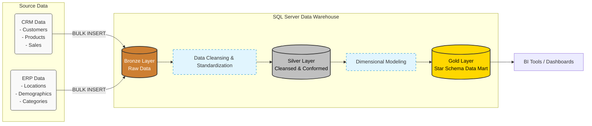

# SQL Data Warehouse Project

SQL Server를 기반으로 구축한 엔드투엔드(End-to-End) 데이터 웨어하우스 파이프라인입니다. 
Medallion 아키텍처(Bronze, Silver, Gold 계층)를 채택하여, 서로 다른 시스템(CRM 및 ERP)에서 발생한 원천 데이터를 수집, 정제한 후 분석에 최적화된 형태(Star Schema)로 변환하는 전체 ETL 과정을 담고 있습니다.

## 🏗️ Architecture & Data Flow

CSV 형태의 원천 데이터를 시작으로, 최종 분석용 데이터 마트를 구축하기까지의 데이터 흐름입니다.



## ✨ Key Features & Pipeline Layers

데이터 파이프라인은 데이터 품질과 가공 목적에 따라 명확히 분리되어 있습니다.

* **Bronze Layer (Raw Data):** 소스 시스템의 데이터(CSV)를 가공 없이 그대로 적재하는 단계입니다. `BULK INSERT`를 사용하여 빠른 데이터 섭취(Ingestion)를 목표로 합니다.
* **Silver Layer (Cleansed & Conformed):** 데이터 정제 및 정규화가 이루어지는 단계입니다. 데이터 타입 캐스팅, 결측치 처리, 날짜 및 문자열 포맷 표준화, CRM과 ERP 시스템 간의 중복 제거 로직 등이 포함되어 있습니다.
* **Gold Layer (Data Mart):** 비즈니스 인텔리전스(BI) 및 분석 쿼리에 최적화된 계층입니다. Silver 계층의 데이터를 결합하여 Fact 테이블(판매 내역)과 Dimension 테이블(고객, 제품)로 구성된 Star Schema 형태의 뷰(View)를 제공합니다.
* **Data Quality (QA):** Silver 계층 적재 이후 데이터 무결성, 비즈니스 로직(예: Sales = Qty * Price), Primary Key 중복 여부 등을 검증하는 QA 스크립트를 운용합니다.

## 📂 Project Structure

```text
📁 sql-data-warehouse-project
├── 📄 scripts/
│   ├── 📄 init_database.sql         # DB 초기화 및 Schema(bronze, silver, gold) 생성 로직
│   ├── 📁 bronze/                   # 원천 데이터 적재를 위한 DDL 및 저장 프로시저
│   ├── 📁 silver/                   # 데이터 정제 및 변환을 위한 DDL 및 저장 프로시저
│   └── 📁 gold/                     # 최종 분석용 뷰(Views) 생성을 위한 DDL
├── 📄 tests/                        
│   └── 📄 quality_checks_silver.sql # Silver Layer 데이터 품질 검증(QA) 스크립트
├── 📁 datasets/                     # 테스트용 원본 CSV 데이터셋 위치
└── 📄 LICENSE                       # MIT License
```

## 🚀 How to Run

1. **데이터베이스 초기화:** SSMS(SQL Server Management Studio) 또는 Azure Data Studio에서 `scripts/init_database.sql`을 실행하여 `DataWarehouse` 데이터베이스와 스키마를 생성합니다.
2. **테이블 생성 및 데이터 적재:**
   `scripts/bronze/ddl_bronze.sql`과 `scripts/bronze/proc_load_bronze.sql`을 실행하여 원천 데이터를 적재합니다. *(이때 CSV 파일의 로컬 경로를 본인의 환경에 맞게 수정해야 합니다.)*
3. **데이터 정제 (Silver):**
   `scripts/silver/ddl_silver.sql` 실행 후, `proc_load_silver.sql` 프로시저를 실행하여 데이터를 클렌징합니다.
4. **품질 검증 (QA):**
   `tests/quality_checks_silver.sql` 쿼리를 실행하여 데이터 무결성을 테스트합니다. 반환되는 row가 없다면 정상입니다.
5. **데이터 마트 구성 (Gold):**
   `scripts/gold/ddl_gold.sql`을 실행하여 분석에 사용될 최종 Star Schema 기반 View 객체를 생성합니다.

## 📄 License
이 프로젝트는 MIT 라이선스(MIT License)에 따라 배포됩니다. 자세한 내용은 `LICENSE` 파일을 참고하세요.