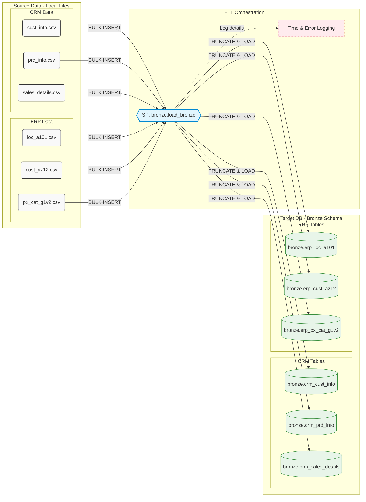

```mermaid
graph LR
    %% 스타일 정의
    classDef sourceFile fill:#f9f9f9,stroke:#333,stroke-width:1px;
    classDef process fill:#e1f5fe,stroke:#0288d1,stroke-width:2px;
    classDef targetTable fill:#e8f5e9,stroke:#388e3c,stroke-width:1px;
    classDef errLog fill:#ffebee,stroke:#d32f2f,stroke-width:1px,stroke-dasharray: 5 5;

    %% Source Data Layer
    subgraph Source [Source Data - Local Files]
        subgraph CRM_Source [CRM Data]
            C1(cust_info.csv):::sourceFile
            C2(prd_info.csv):::sourceFile
            C3(sales_details.csv):::sourceFile
        end
        subgraph ERP_Source [ERP Data]
            E1(loc_a101.csv):::sourceFile
            E2(cust_az12.csv):::sourceFile
            E3(px_cat_g1v2.csv):::sourceFile
        end
    end

    %% Process Layer
    subgraph Process [ETL Orchestration]
        SP{{SP: bronze.load_bronze}}:::process
        Log[Time & Error Logging]:::errLog
        SP -.->|Log details| Log
    end

    %% Target Data Layer
    subgraph Target [Target DB - Bronze Schema]
        subgraph CRM_Tables [CRM Tables]
            T1[(bronze.crm_cust_info)]:::targetTable
            T2[(bronze.crm_prd_info)]:::targetTable
            T3[(bronze.crm_sales_details)]:::targetTable
        end
        subgraph ERP_Tables [ERP Tables]
            T4[(bronze.erp_loc_a101)]:::targetTable
            T5[(bronze.erp_cust_az12)]:::targetTable
            T6[(bronze.erp_px_cat_g1v2)]:::targetTable
        end
    end

    %% Data Flow Connections
    C1 -->|BULK INSERT| SP
    C2 -->|BULK INSERT| SP
    C3 -->|BULK INSERT| SP
    E1 -->|BULK INSERT| SP
    E2 -->|BULK INSERT| SP
    E3 -->|BULK INSERT| SP

    SP -->|TRUNCATE & LOAD| T1
    SP -->|TRUNCATE & LOAD| T2
    SP -->|TRUNCATE & LOAD| T3
    SP -->|TRUNCATE & LOAD| T4
    SP -->|TRUNCATE & LOAD| T5
    SP -->|TRUNCATE & LOAD| T6
```