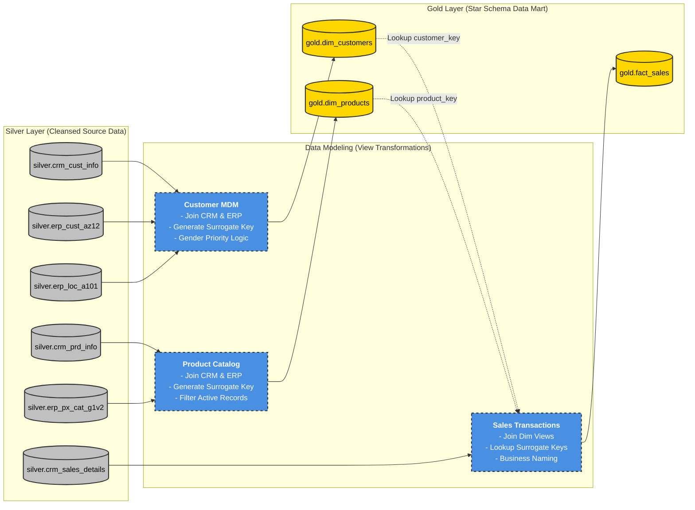

```mermaid
graph LR
    %% 스타일 정의
    classDef silver fill:#c0c0c0,stroke:#333,stroke-width:2px,color:#000;
    classDef gold fill:#ffd700,stroke:#333,stroke-width:2px,color:#000;
    classDef transform fill:#4a90e2,stroke:#333,stroke-width:2px,color:#fff,stroke-dasharray: 5 5;

    subgraph "Silver Layer (Cleansed Source Data)"
        S_CUST[(silver.crm_cust_info)]:::silver
        S_CUST_ERP[(silver.erp_cust_az12)]:::silver
        S_LOC[(silver.erp_loc_a101)]:::silver
        
        S_PRD[(silver.crm_prd_info)]:::silver
        S_PX[(silver.erp_px_cat_g1v2)]:::silver
        
        S_SLS[(silver.crm_sales_details)]:::silver
    end

    subgraph "Data Modeling (View Transformations)"
        T_DIM_CUST[<b>Customer MDM</b><br/>- Join CRM & ERP<br/>- Generate Surrogate Key<br/>- Gender Priority Logic]:::transform
        T_DIM_PRD[<b>Product Catalog</b><br/>- Join CRM & ERP<br/>- Generate Surrogate Key<br/>- Filter Active Records]:::transform
        T_FACT_SLS[<b>Sales Transactions</b><br/>- Join Dim Views<br/>- Lookup Surrogate Keys<br/>- Business Naming]:::transform
    end

    subgraph "Gold Layer (Star Schema Data Mart)"
        G_DIM_CUST[(gold.dim_customers)]:::gold
        G_DIM_PRD[(gold.dim_products)]:::gold
        G_FACT[(gold.fact_sales)]:::gold
    end

    %% Customer Dimension Flow
    S_CUST --> T_DIM_CUST
    S_CUST_ERP --> T_DIM_CUST
    S_LOC --> T_DIM_CUST
    T_DIM_CUST --> G_DIM_CUST

    %% Product Dimension Flow
    S_PRD --> T_DIM_PRD
    S_PX --> T_DIM_PRD
    T_DIM_PRD --> G_DIM_PRD

    %% Sales Fact Flow
    S_SLS --> T_FACT_SLS
    
    %% Surrogate Key Lookups (의존성 표현)
    G_DIM_CUST -. "Lookup customer_key" .-> T_FACT_SLS
    G_DIM_PRD -. "Lookup product_key" .-> T_FACT_SLS
    
    T_FACT_SLS --> G_FACT
```