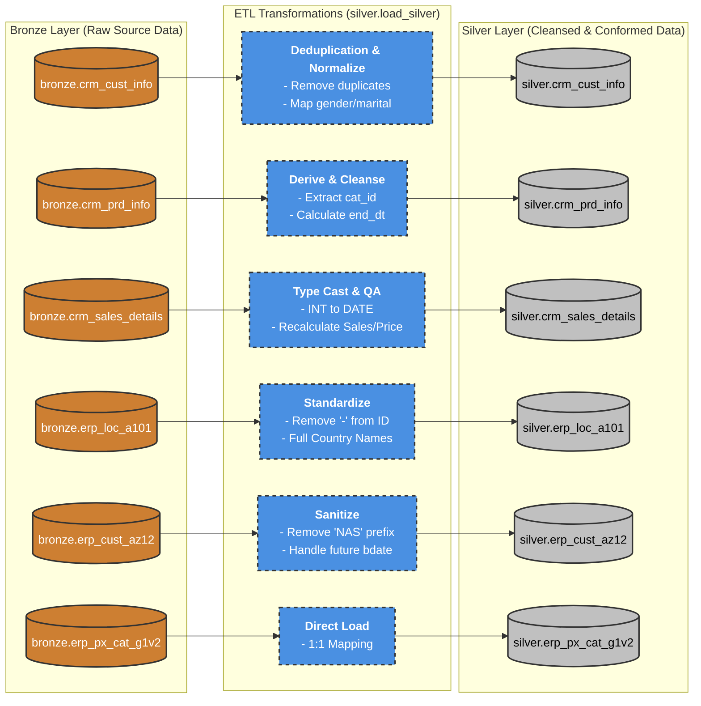

```mermaid
graph LR
    %% 스타일 정의
    classDef bronze fill:#cd7f32,stroke:#333,stroke-width:2px,color:#fff;
    classDef silver fill:#c0c0c0,stroke:#333,stroke-width:2px,color:#000;
    classDef transform fill:#4a90e2,stroke:#333,stroke-width:2px,color:#fff,stroke-dasharray: 5 5;

    subgraph "Bronze Layer (Raw Source Data)"
        B_CUST[(bronze.crm_cust_info)]:::bronze
        B_PRD[(bronze.crm_prd_info)]:::bronze
        B_SLS[(bronze.crm_sales_details)]:::bronze
        B_LOC[(bronze.erp_loc_a101)]:::bronze
        B_CUST_ERP[(bronze.erp_cust_az12)]:::bronze
        B_PX[(bronze.erp_px_cat_g1v2)]:::bronze
    end

    subgraph "ETL Transformations (silver.load_silver)"
        T_CUST[<b>Deduplication & Normalize</b><br/>- Remove duplicates<br/>- Map gender/marital]:::transform
        T_PRD[<b>Derive & Cleanse</b><br/>- Extract cat_id<br/>- Calculate end_dt]:::transform
        T_SLS[<b>Type Cast & QA</b><br/>- INT to DATE<br/>- Recalculate Sales/Price]:::transform
        T_LOC[<b>Standardize</b><br/>- Remove '-' from ID<br/>- Full Country Names]:::transform
        T_CUST_ERP[<b>Sanitize</b><br/>- Remove 'NAS' prefix<br/>- Handle future bdate]:::transform
        T_PX[<b>Direct Load</b><br/>- 1:1 Mapping]:::transform
    end

    subgraph "Silver Layer (Cleansed & Conformed Data)"
        S_CUST[(silver.crm_cust_info)]:::silver
        S_PRD[(silver.crm_prd_info)]:::silver
        S_SLS[(silver.crm_sales_details)]:::silver
        S_LOC[(silver.erp_loc_a101)]:::silver
        S_CUST_ERP[(silver.erp_cust_az12)]:::silver
        S_PX[(silver.erp_px_cat_g1v2)]:::silver
    end

    %% 데이터 흐름 연결
    B_CUST --> T_CUST --> S_CUST
    B_PRD --> T_PRD --> S_PRD
    B_SLS --> T_SLS --> S_SLS
    
    B_LOC --> T_LOC --> S_LOC
    B_CUST_ERP --> T_CUST_ERP --> S_CUST_ERP
    B_PX --> T_PX --> S_PX
```